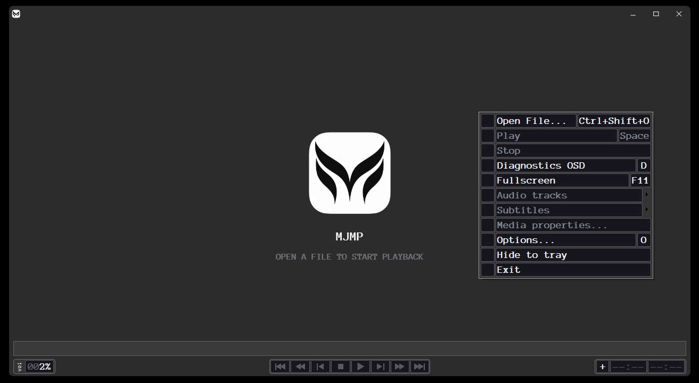
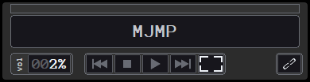
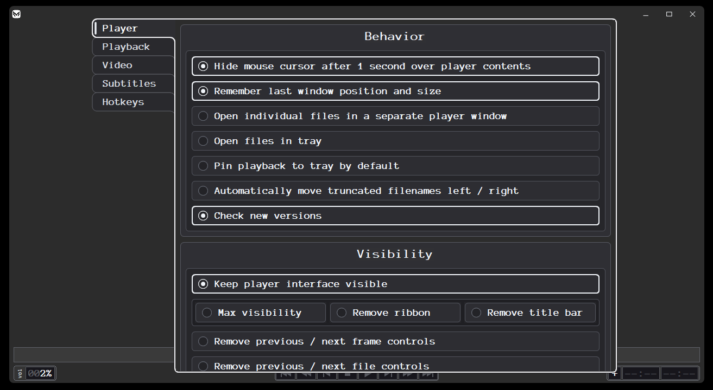
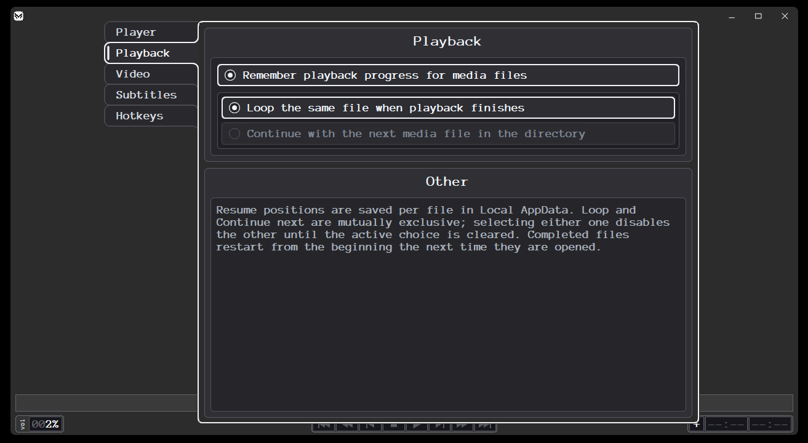
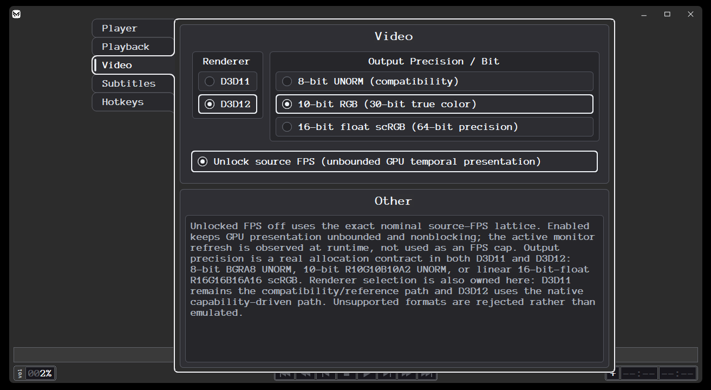
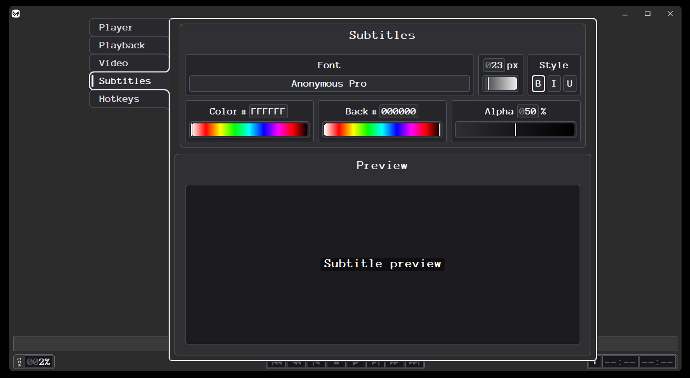
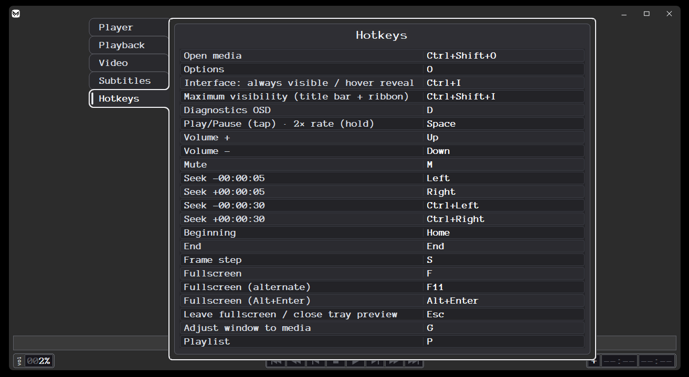

<h1 align="center">MJMP</h1>

<p align="center">
  <strong>High-performance portable x64 Windows multimedia player with broad codec support and GPU-accelerated playback.</strong>
</p>

<p align="center">
<a href="https://github.com/MarceloAlejandroJorquera/MJMP/releases/tag/v1"></a>&nbsp;
<a href="https://github.com/MarceloAlejandroJorquera/MJMP/releases/latest"></a>&nbsp;
<a href="#system-requirements"></a>&nbsp;
<a href="docs/ARCHITECTURE.md"></a>&nbsp;
<a href="docs/ARCHITECTURE.md"></a>
</p>

<p align="center">
<a href="#d3d11"></a>&nbsp;
<a href="#d3d12"></a>&nbsp;
<a href="https://ffmpeg.org/"></a>&nbsp;
<a href="https://code.videolan.org/videolan/dav1d"></a>&nbsp;
<a href="https://github.com/fraunhoferhhi/vvdec"></a>&nbsp;
<a href="https://lib.openmpt.org/libopenmpt/"></a>&nbsp;
<a href="https://learn.microsoft.com/windows/win32/coreaudio/wasapi"></a>
</p>

<p align="center">
<a href="https://cmake.org/"></a>&nbsp;
<a href="https://ninja-build.org/"></a>&nbsp;
<a href="https://github.com/microsoft/vcpkg"></a>&nbsp;
<a href="docs/ARCHITECTURE.md"></a>
</p>

<p align="center">
<a href="https://github.com/MarceloAlejandroJorquera/MJMP/releases/latest"></a>&nbsp;
<a href="#release-integrity"></a>&nbsp;
<a href="#update-checks"></a>
</p>

<p align="center">
  <a href="https://github.com/MarceloAlejandroJorquera/MJMP/releases/latest"><strong>Download latest release</strong></a>
  &nbsp;·&nbsp;
  <a href="CHANGELOG.md">Changelog</a>
  &nbsp;·&nbsp;
  <a href="RELEASE_NOTES_v1.md">v1 release notes</a>
  &nbsp;·&nbsp;
  <a href="SECURITY.md">Security</a>
</p>

<p align="center">
  <code>Single EXE</code>
  ·
  <code>No installer</code>
  ·
  <code>No codec pack required</code>
  ·
  <code>Windows x64</code>
</p>

---

<h2 align="center">Overview</h2>

**MJMP** is a portable Windows multimedia player distributed as a **single executable**: `MJMPv1.exe`.

Its media/runtime stack is linked into the application, so users do not need to separately install FFmpeg, a codec pack, libopenmpt, dav1d, VVdeC, or the Microsoft Visual C++ Redistributable.

On a fresh configuration, MJMP starts **maximized** and selects **D3D11 by default** for broad compatibility. **D3D12** remains available as an optional renderer for capable systems.

<table align="center">
  <thead>
    <tr>
      <th>Area</th>
      <th>Highlights</th>
    </tr>
  </thead>
  <tbody>
    <tr>
      <td><strong>Distribution</strong></td>
      <td>Portable <code>MJMPv1.exe</code>; no installer; no external codec pack</td>
    </tr>
    <tr>
      <td><strong>Rendering</strong></td>
      <td>D3D11 compatibility path + optional D3D12 path</td>
    </tr>
    <tr>
      <td><strong>Output precision</strong></td>
      <td>8-bit UNORM, 10-bit RGB, 16-bit-float scRGB</td>
    </tr>
    <tr>
      <td><strong>Playback</strong></td>
      <td>Source-rate / unlocked presentation modes, seeking and frame/file controls</td>
    </tr>
    <tr>
      <td><strong>Audio</strong></td>
      <td>WASAPI output with bundled decode/conversion paths</td>
    </tr>
    <tr>
      <td><strong>Subtitles</strong></td>
      <td>Embedded and sidecar subtitle handling with configurable styling and preview</td>
    </tr>
    <tr>
      <td><strong>Tray</strong></td>
      <td>Live playback preview, transport controls, pinning and fullscreen expansion</td>
    </tr>
    <tr>
      <td><strong>Library workflow</strong></td>
      <td>Playlist, history, regex search, hotkeys and configurable interface visibility</td>
    </tr>
    <tr>
      <td><strong>Updates</strong></td>
      <td>Optional GitHub release checks from <strong>Options → Player → Check new versions</strong></td>
    </tr>
    <tr>
      <td><strong>Integrity</strong></td>
      <td>SHA-256 manifest published beside each release executable</td>
    </tr>
  </tbody>
</table>

---

<h2 align="center">Player</h2>

<p align="center">
  
</p>

<p align="center">
  <em>Main player window with MJMP's custom context menu and playback interface.</em>
</p>

<h3 align="center">Tray playback</h3>

<p align="center">
  
</p>

<p align="center">
  <em>Compact tray preview with transport controls, fullscreen expansion and pinning.</em>
</p>

---

<h2 align="center">Options</h2>

<p align="center">
  MJMP exposes renderer, playback, subtitle, interface and hotkey configuration through its custom native Options interface.
</p>

<h3 align="center">Player</h3>
<p align="center">
  
</p>
<p align="center"><em>General behavior, interface visibility and update-check controls.</em></p>

<h3 align="center">Playback</h3>
<p align="center">
  
</p>
<p align="center"><em>Playback progress, looping and directory-continuation behavior.</em></p>

<h3 align="center">Video</h3>
<p align="center">
  
</p>
<p align="center"><em>D3D11/D3D12 selection, output precision and presentation controls.</em></p>

<h3 align="center">Subtitles</h3>
<p align="center">
  
</p>
<p align="center"><em>Subtitle font, color, background, alpha and preview controls.</em></p>

<h3 align="center">Hotkeys</h3>
<p align="center">
  
</p>
<p align="center"><em>Keyboard shortcuts for playback, navigation and interface actions.</em></p>

---

<h2 align="center">Download and run</h2>

1. Open the [latest release](https://github.com/MarceloAlejandroJorquera/MJMP/releases/latest).
2. Download **`MJMPv1.exe`** and **`SHA256SUMS.txt`**.
3. Optionally verify the executable using the SHA-256 instructions below.
4. Run `MJMPv1.exe` directly.

No installation step is required.

> [!NOTE]
> Windows may display its normal reputation/security prompt for a newly published unsigned executable. Download MJMP only from this repository's **Releases** page and verify the published SHA-256 checksum when desired.

---

<h2 align="center">Release integrity</h2>

Every published release is intended to provide these assets:

```text
MJMPv1.exe
SHA256SUMS.txt
```

Verify the executable in PowerShell:

```powershell
Get-FileHash .\MJMPv1.exe -Algorithm SHA256
Get-Content .\SHA256SUMS.txt
```

The SHA-256 value returned by `Get-FileHash` must match the `MJMPv1.exe` entry in `SHA256SUMS.txt`.

The private release build generates `SHA256SUMS.txt` from the exact executable copied into `dist`, so the manifest belongs to the same binary being published.

---

<h2 align="center">Portable dependency model</h2>

MJMP is built to keep its media/runtime dependencies inside the executable.

The current release build uses:

- **C++23**
- **MSVC 19.51**
- **CMake 4.4.2**
- **Ninja 1.13.2**
- **vcpkg static dependencies**
- **FFmpeg 9.0.1**
- **dav1d** for AV1 decoding
- **VVdeC** for VVC / H.266 decoding
- **libopenmpt** for tracker/module playback
- **WASAPI** for Windows audio output
- **D3D11** and **D3D12** rendering paths
- **static MSVC runtime**

The release executable is intended to depend only on normal Windows system DLLs at runtime rather than third-party codec/runtime DLLs.

This means users do **not** need to separately install:

- FFmpeg
- LAV Filters
- K-Lite or another codec pack
- dav1d
- VVdeC
- libopenmpt
- vcpkg
- Visual Studio
- the Microsoft Visual C++ Redistributable

---

<h2 align="center">Rendering</h2>

### D3D11

D3D11 is the default renderer on a fresh configuration and is intended to provide the broadest compatibility.

### D3D12

D3D12 is available as an optional renderer on supported hardware and drivers.

MJMP exposes real output-allocation modes for:

- **8-bit UNORM**
- **10-bit RGB**
- **16-bit-float scRGB**

Actual output behavior depends on source media, Windows composition, display configuration, GPU capabilities and driver support.

---

<h2 align="center">Media stack</h2>

MJMP uses its bundled FFmpeg-based media stack together with specialized decoding paths where applicable.

The current project includes infrastructure for:

- common video/audio containers through FFmpeg;
- H.264 / AVC and H.265 / HEVC playback paths;
- VP9 playback;
- AV1 through bundled dav1d support;
- VVC / H.266 through bundled VVdeC support;
- tracker/module formats through libopenmpt;
- embedded artwork;
- embedded and sidecar subtitles.

Container, profile and hardware-acceleration compatibility can vary by source file, GPU and driver.

---

<h2 align="center">Update checks</h2>

When **Check new versions** is enabled under **Options → Player**:

- the first check occurs about **10 seconds after startup**;
- a long-running MJMP session rechecks about **every 6 hours**;
- network work is asynchronous and does not block playback or the UI;
- the same available release is notified only once per process session;
- MJMP opens the corresponding GitHub release page;
- MJMP does **not** automatically download or execute updates.

The update source is this repository:

```text
MarceloAlejandroJorquera/MJMP
```

The option can be disabled at any time.

---

<h2 align="center">Public versioning</h2>

MJMP public versions use progressively extended numeric components:

```text
1
1.1
1.1.1
1.1.1.1
1.1.1.2
```

GitHub release tags use the corresponding `v` prefix:

```text
v1
v1.1
v1.1.1
v1.1.1.1
v1.1.1.2
```

---

<h2 align="center">System requirements</h2>

- **64-bit Windows 10 or Windows 11**
- Working Windows audio stack
- **D3D11-capable GPU and driver** for the default renderer
- **D3D12-capable GPU and driver** when selecting D3D12

Hardware acceleration availability varies by codec, GPU and driver.

---

<h2 align="center">Repository scope</h2>

This repository is the **public binary-release repository** for MJMP.

It contains:

- public project documentation;
- screenshots;
- release notes;
- changelog information;
- release-integrity guidance;
- public project metadata.

The application executable is distributed through **GitHub Releases** rather than committed to the repository tree.

Private source code, private build trees and internal development assets are not published here.

---

<h2 align="center">Security</h2>

For vulnerability reporting and security information, see [SECURITY.md](SECURITY.md).

---

<h2 align="center">License</h2>

See [LICENSE.txt](LICENSE.txt).

Third-party components incorporated into MJMP remain subject to their respective licenses.

---

<p align="center">
  <strong>MJMP</strong><br>
  Portable Windows multimedia playback.
</p>
